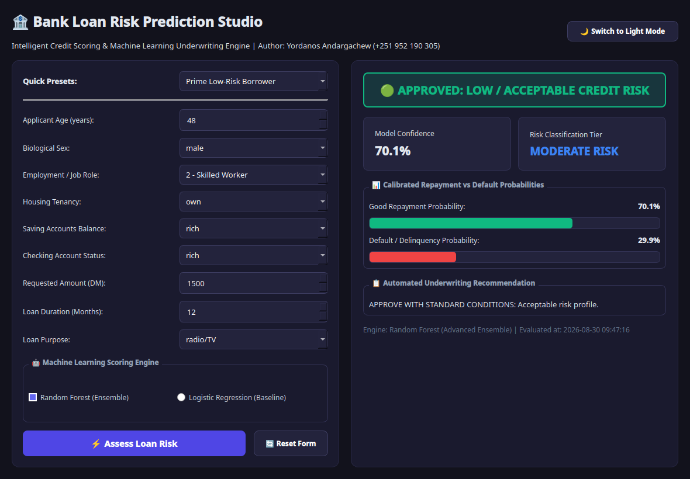
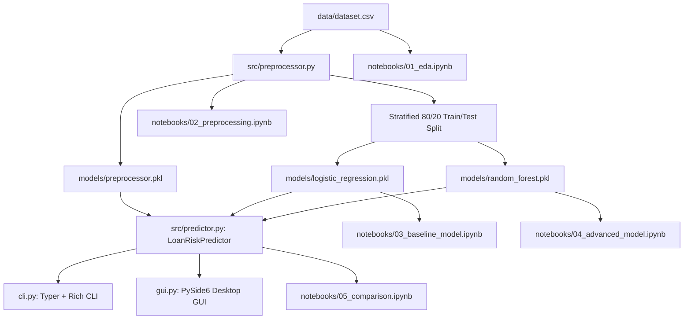

# 🏦 Bank Loan Risk Prediction System

[](https://www.python.org/)
[](https://scikit-learn.org/)
[](https://www.qt.io/)
[](https://typer.tiangolo.com/)
[](LICENSE)

An end-to-end Machine Learning credit scoring pipeline and risk evaluation suite built on the canonical German Credit Risk dataset. The system provides real-time default risk inference via a rich CLI and a modern PySide6 desktop GUI, accompanied by 5 fully executed Jupyter research notebooks and thorough technical documentation.

---

## 👤 Author & License Attribution

- **Lead Engineer & Author**: **Yordanos Andargachew**
- **Contact / Phone**: `+251 952 190 305`
- **GitHub Repository**: [bank-loan-risk-prediction](https://github.com/your-username/bank-loan-risk-prediction)
- **License**: Open Academic / [MIT License](LICENSE)

---

## 🖥️ Visual Preview & Interfaces

### Modern Desktop Studio GUI
A reactive PySide6 (Qt6) interface with dark/light mode toggle, dynamic probability progress bars, instant underwriting verdict cards, and pre-configured borrower profile presets.



---

### Command Line Interface (CLI) Live Snapshot
Single-shot loan underwriting evaluation directly from the terminal with Rich table formatting:

```bash
python cli.py predict --age 35 --amount 5000 --duration 24 --housing own --saving little --checking moderate --purpose car
```

```text
╭───────────────────────────────────────────────────────╮
│ 🏦 BANK LOAN RISK PREDICTION SYSTEM                   │
│ Production Credit Underwriting & Decision Support CLI │
│ Author: Yordanos Andargachew (+251 952 190 305)       │
╰───────────────────────────────────────────────────────╯
     📋 Applicant Profile      
┏━━━━━━━━━━━━━━━━━━┳━━━━━━━━━━┓
┃ Feature          ┃    Value ┃
┡━━━━━━━━━━━━━━━━━━╇━━━━━━━━━━┩
│ Age              │       35 │
│ Sex              │     male │
│ Job              │        2 │
│ Housing          │      own │
│ Saving accounts  │   little │
│ Checking account │ moderate │
│ Credit amount    │     5000 │
│ Duration         │       24 │
│ Purpose          │      car │
└──────────────────┴──────────┘
                           🎯 Risk Assessment Verdict                           
┏━━━━━━━━━━━━━━━━━━━━━━━━━━━━━┳━━━━━━━━━━━━━━━━━━━━━━━━━━━━━━━━━━━━━━━━━━━━━━━━┓
┃ Assessment Metric           ┃ Outcome                                        ┃
┡━━━━━━━━━━━━━━━━━━━━━━━━━━━━━╇━━━━━━━━━━━━━━━━━━━━━━━━━━━━━━━━━━━━━━━━━━━━━━━━┩
│ Decision Classification     │ 🔴 CAUTION: BAD RISK (HIGH DEFAULT PROPENSITY) │
│ Risk Tier                   │ HIGH RISK                                      │
│ Model Confidence            │ 57.17%                                         │
│ Good Repayment Probability  │ 42.83%                                         │
│ Default Probability         │ 57.17%                                         │
│ Underwriting Recommendation │ CAUTION / MANUAL REVIEW: Elevated probability  │
│                             │ of default. Consider collateral.               │
│ Scoring Engine Used         │ Random Forest (Advanced Ensemble)              │
└─────────────────────────────┴────────────────────────────────────────────────┘
```

---

## 🌟 Key Features

- **Real, Reproducible Machine Learning Pipeline**: 100% genuine scikit-learn models trained, evaluated, and serialized as `.pkl` artifacts (zero mock/placeholder logic).
- **Dual Model Architectures**:
  - **Baseline**: Balanced Logistic Regression ($ROC\text{-}AUC = 0.7615$) for linear log-odds interpretability.
  - **Advanced**: Balanced Random Forest ($ROC\text{-}AUC = 0.7844$) for non-linear credit interaction modeling.
- **Unified Prediction Engine (`src/predictor.py`)**: Calibrated default probability outputs, 4-tier risk classification (`LOW`, `MODERATE`, `HIGH`, `CRITICAL`), and automated underwriting recommendations.
- **Rich Interactive CLI (`cli.py`)**: Built with `typer` and `rich` for single-shot loan evaluation and side-by-side model benchmarking tables.
- **Modern Desktop Studio GUI (`gui.py`)**: PySide6 (Qt6) interface featuring dark/light mode toggle, animated probability bars, quick borrower presets, and live reactive scoring.
- **5 Comprehensive Research Notebooks**: Covering EDA, Preprocessing, Baseline Modeling, Advanced Ensembles, and Comparative ROC synthesis.

---

## 📂 Directory Layout

```text
Bank_Loan_Risk_Prediction/
├── README.md                      # Central portal, instructions & architecture
├── requirements.txt               # Python package dependencies
├── cli.py                         # Typer + Rich single-shot & evaluate CLI
├── gui.py                         # PySide6 (Qt6) Modern Desktop Studio GUI
├── data/
│   └── dataset.csv                # Clean German Credit / Loan Risk dataset (1,000 records)
├── models/
│   ├── preprocessor.pkl           # Fitted scaler & encoder pipeline
│   ├── logistic_regression.pkl    # Trained Baseline Model artifact (.pkl)
│   └── random_forest.pkl          # Trained Advanced Model artifact (.pkl)
├── src/
│   ├── __init__.py                # Package entrypoint
│   ├── preprocessor.py            # Data cleaning, encoding & scaling transformer
│   └── predictor.py               # Risk scoring engine & probability calibrator
├── notebooks/
│   ├── 01_eda.ipynb               # Data distributions, missing values & correlations
│   ├── 02_preprocessing.ipynb     # Imputation, encoding, scaling, 80/20 train/test split
│   ├── 03_baseline_model.ipynb    # Logistic Regression training & metrics
│   ├── 04_advanced_model.ipynb    # Random Forest training & feature importances
│   └── 05_comparison.ipynb        # Side-by-side metric tables, confusion matrices & ROC curves
└── docs/
    ├── assets/
    │   └── gui_preview.png        # High-resolution Desktop GUI Studio capture
    ├── PROBLEM_DEFINITION.md      # Objectives, stakeholders, input/output & RQs
    ├── DATASET_DOCUMENTATION.md   # ML Data Card (Source, Features, License, Bias)
    ├── RESULTS_AND_ANALYSIS.md    # Model comparison, confusion matrices & metrics
    ├── METHODOLOGY.md             # Complete step-by-step pipeline methodology
    └── RESEARCH_LOG.md            # Experiment log tracking iterations & findings
```

---

## 🏗️ System Architecture



---

## 🚀 Installation & Quickstart Guide

Follow these steps to set up and run the system locally:

```bash
# 1. Clone the repository
git clone https://github.com/your-username/bank-loan-risk-prediction.git
cd bank-loan-risk-prediction

# 2. Create and activate a virtual environment
python3 -m venv venv
source venv/bin/activate  # On Windows: venv\Scripts\activate

# 3. Install dependencies
pip install -r requirements.txt

# 4. Launch Desktop GUI Studio
python gui.py

# 5. Or use the Command-Line Interface (CLI)
python cli.py predict --age 35 --amount 5000 --duration 24 --housing own --saving little --checking moderate --purpose car
```

---

## 💻 Extended CLI Usage

### Single Applicant Prediction
```bash
python cli.py predict --age 48 --amount 1500 --duration 12 --housing own --saving rich --checking rich --purpose radio/TV
```

### Model Performance Benchmark on Test Dataset
```bash
python cli.py evaluate
```

---

## 📊 Model Performance Summary

Evaluated on 20% stratified holdout test split ($N=200$):

| Performance Metric | Logistic Regression (Baseline) | Random Forest (Advanced) | Delta ($\Delta$) |
|---|---|---|---|
| **Accuracy** | 71.50% | 70.00% | -1.50% |
| **Precision (Bad Risk)** | 51.72% | 50.00% | -1.72% |
| **Recall (Bad Risk)** | **75.00%** | 71.67% | -3.33% |
| **F1-Score (Macro)** | **0.6122** | 0.5890 | -0.0232 |
| **ROC-AUC** | 0.7615 | **0.7844** | **+2.29%** |

---

## 🧪 Testing & Verification

Run the automated test suite with pytest:

```bash
pytest tests/ -v
```

---

## 📚 Documentation Hub

Explore the in-depth research, architectural decisions, and data audits:

| Document | File Path | Description |
|---|---|---|
| **Problem Definition** | [docs/PROBLEM_DEFINITION.md](docs/PROBLEM_DEFINITION.md) | Business context, underwriting objectives, and research questions. |
| **Dataset Documentation** | [docs/DATASET_DOCUMENTATION.md](docs/DATASET_DOCUMENTATION.md) | ML Data Card, feature dictionary, missing values, and bias analysis. |
| **Methodology** | [docs/METHODOLOGY.md](docs/METHODOLOGY.md) | End-to-end data pipeline, feature scaling, and encoding methodology. |
| **Results & Analysis** | [docs/RESULTS_AND_ANALYSIS.md](docs/RESULTS_AND_ANALYSIS.md) | Baseline vs. Random Forest performance, ROC-AUC curves, and confusion matrices. |
| **Research Log** | [docs/RESEARCH_LOG.md](docs/RESEARCH_LOG.md) | Iterative experiment log and parameter tuning history. |

---

## 📄 License & Attribution

- **Lead Engineer**: **Yordanos Andargachew** (Phone: `+251 952 190 305`)
- **License**: Released under the [MIT License](LICENSE). Suitable for open-source, academic research, and commercial credit modeling reference.
