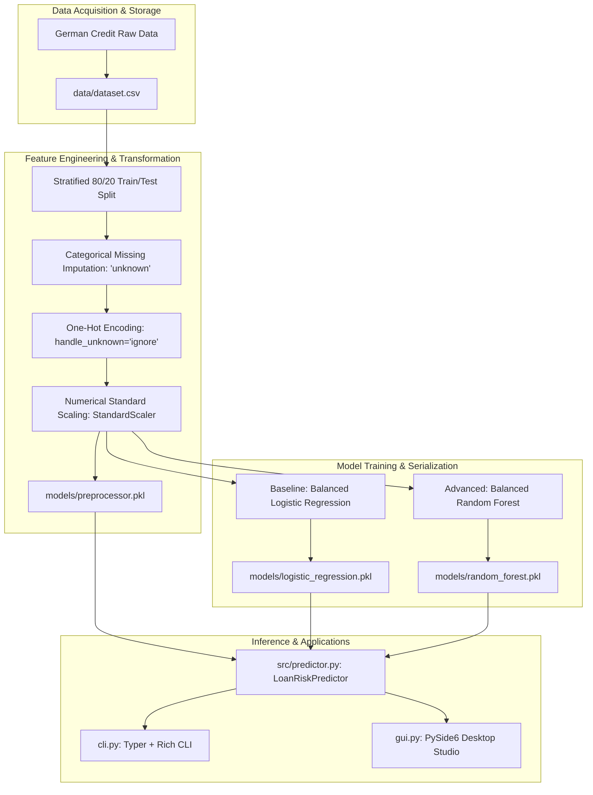

# Machine Learning Pipeline Methodology

**Author**: Yordanos Andargachew  
**Contact**: `+251 952 190 305`  
**Project**: Bank Loan Risk Prediction System  
**Date**: August 2026  

---

## 1. End-to-End Pipeline Architecture

The system follows a strict, modular Machine Learning lifecycle designed for reproducibility, testability, and zero-leakage production inference:

---

## 2. Step-by-Step Methodological Phases

### Phase 1: Data Acquisition & Validation
- **Source**: German Credit Risk benchmark dataset (1,000 cases).
- **Target Formatting**: Maps `Risk` to binary ground truth (`good` = 0 / Low Risk, `bad` = 1 / High Risk).
- **Validation**: Strict schema checks ensuring all 9 input features are populated within valid domains.

### Phase 2: Data Preprocessing & Pipeline Construction
- **Missing Value Handling**:
  - `Saving accounts` & `Checking account`: Missing values (18.3% and 39.4%) are imputed with a dedicated string token `'unknown'`, reflecting customer account absence rather than unrecorded data.
- **Categorical One-Hot Encoding**:
  - Features (`Sex`, `Housing`, `Saving accounts`, `Checking account`, `Purpose`) are transformed into dummy indicator vectors using `OneHotEncoder(handle_unknown='ignore', sparse_output=False)`.
- **Numerical Normalization**:
  - `Age`, `Credit amount`, and `Duration` are standardized via `StandardScaler()`:
    $$z = \frac{x - \mu}{\sigma}$$
- **Zero Leakage**: All statistics ($\mu, \sigma$, category sets) are fitted strictly on the 80% training fold and applied to the 20% test fold.

### Phase 3: Model Formulations & Objective Optimization

#### A. Baseline Model: Balanced Logistic Regression
- Solves regularized maximum likelihood with inverse-frequency class weights:
  $$\min_{\mathbf{w}, c} \frac{1}{2} \|\mathbf{w}\|_2^2 + C \sum_{i=1}^n w_{y_i} \log\left(1 + \exp(-y_i (\mathbf{w}^T \mathbf{x}_i + c))\right)$$
- Hyperparameters: `solver='lbfgs'`, `max_iter=1000`, `class_weight='balanced'`, `random_state=42`.

#### B. Advanced Model: Balanced Random Forest Classifier
- Constructs an ensemble of $B=100$ decorrelated decision trees with bootstrap aggregation and random feature subspacing:
  $$\hat{P}(\text{Bad}|x) = \frac{1}{B} \sum_{b=1}^B P_b(\text{Bad}|x)$$
- Hyperparameters: `n_estimators=100`, `max_depth=10`, `min_samples_split=5`, `min_samples_leaf=2`, `class_weight='balanced'`, `random_state=42`.

### Phase 4: Model Evaluation & Serialization
- Models are evaluated on the 200 hold-out samples using Accuracy, Precision, Recall, Macro F1, ROC-AUC, and Confusion Matrices.
- Pipeline and trained models are serialized using `joblib` into binary pickle format (`.pkl`).

### Phase 5: Production Serving & Multi-Modal Interfaces
- **Unified Engine (`src/predictor.py`)**: Implements `LoanRiskPredictor`, loading `.pkl` artifacts and providing calibrated confidence scoring, qualitative risk tier mapping (`LOW`, `MODERATE`, `HIGH`, `CRITICAL`), and underwriting recommendations.
- **CLI (`cli.py`)**: Provides instant single-applicant scoring (`predict`) and comparative evaluation (`evaluate`) formatted via Rich tables.
- **Desktop Studio (`gui.py`)**: Modern PySide6 desktop GUI with dark/light themes, preset borrowers, dynamic probability bars, and instant underwriting verdict cards.
